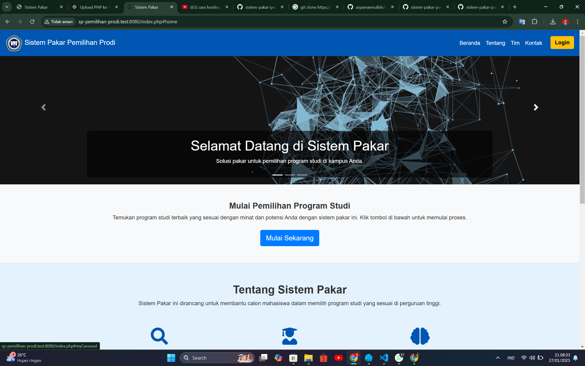
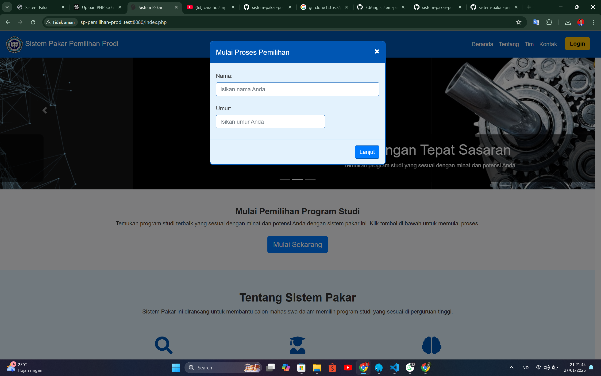
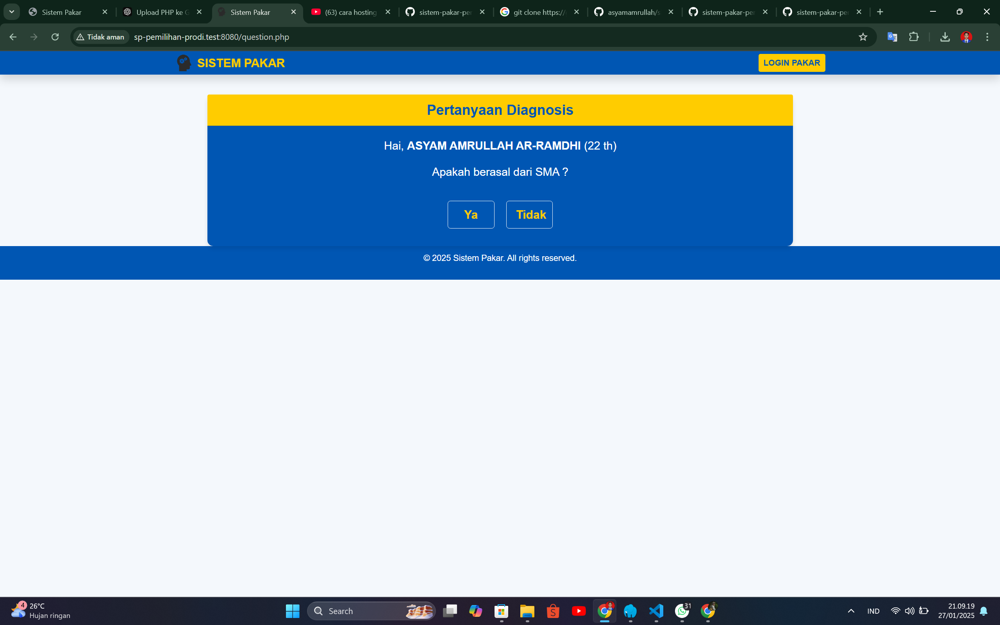
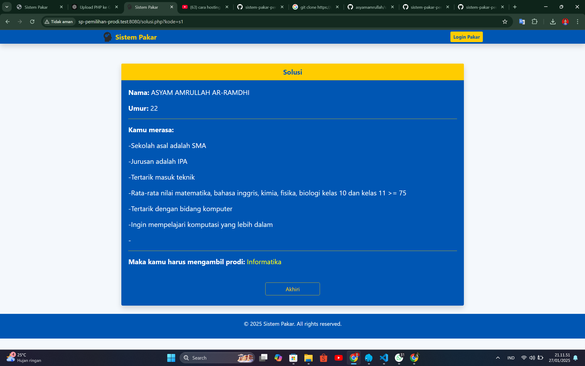
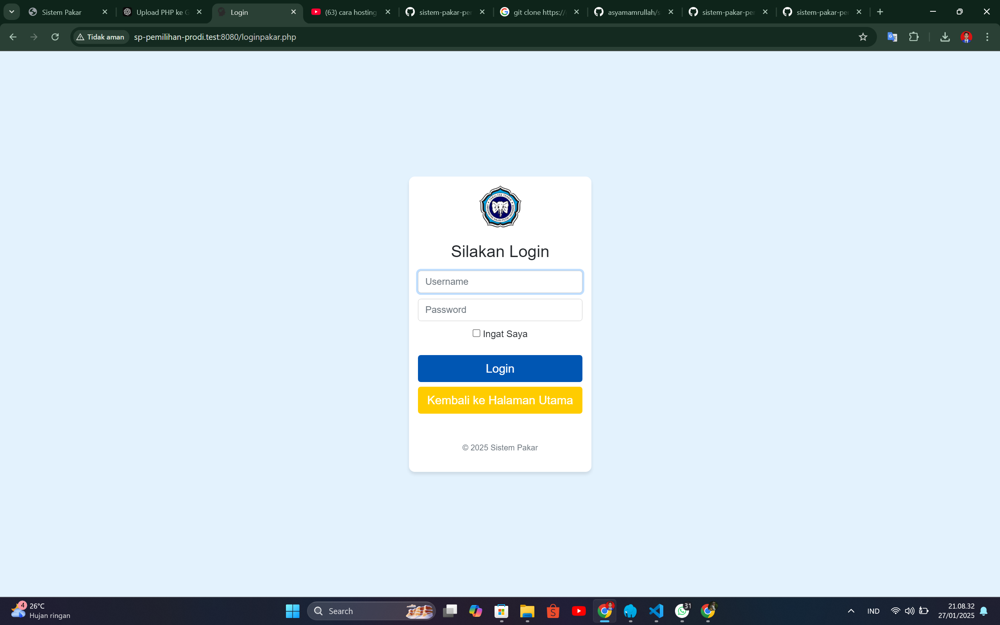
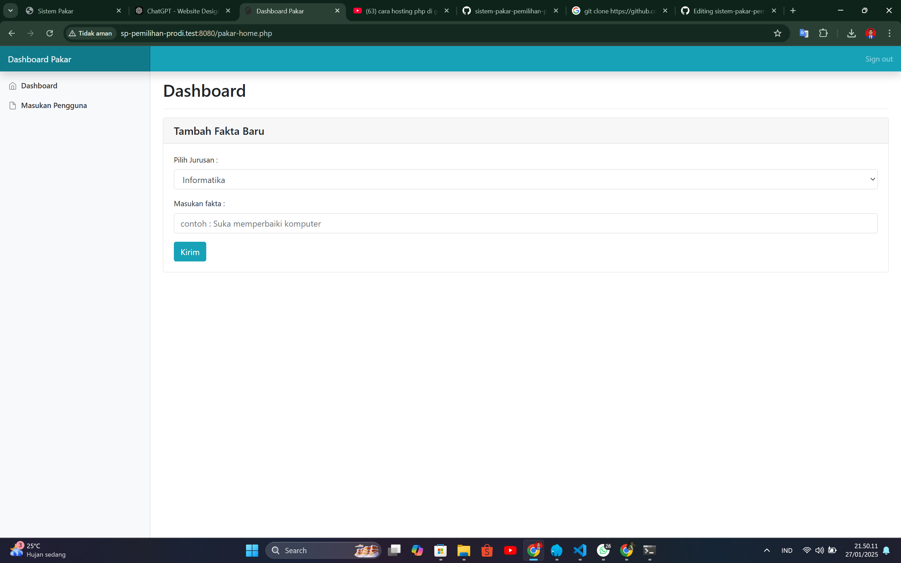

# Sistem Pakar Pemilihan Program Studi

Sistem Pakar Pemilihan Program Studi adalah aplikasi berbasis web yang membantu pengguna (calon mahasiswa) dalam menentukan program studi yang paling sesuai berdasarkan minat dan kemampuan mereka. Proyek ini dibuat menggunakan **PHP**, **HTML**, **CSS**, dan **JavaScript**.

---

## Fitur Utama

- **Input Kriteria**: Pengguna dapat memberikan masukan terkait minat, bakat, dan kemampuan mereka.
- **Algoritma Sistem Pakar**: Sistem memproses data menggunakan metode berbasis aturan (rule-based).
- **Rekomendasi Program Studi**: Sistem memberikan hasil berupa rekomendasi program studi yang paling sesuai.
- **Antarmuka Pengguna**: Desain sederhana dan mudah digunakan.

---

## Teknologi yang Digunakan

- **Backend**: PHP
- **Frontend**: HTML, CSS, JavaScript
- **Database**: MySQL (atau database lain yang kompatibel)
- **Framework**: (sebutkan jika menggunakan framework seperti Laravel atau CodeIgniter, atau tulis "Tanpa framework" jika murni PHP)

---

## Instalasi dan Penggunaan

### Prasyarat
- Server web seperti **XAMPP**, atau **Laragon**
- PHP versi 7.4 atau lebih baru.
- MySQL/MariaDB untuk basis data.

---

## Login Sistem
---
- Username : admin
- Password : admin

## Interface

- Halaman Beranda
  
  

- Halaman Mulai Diagnosa
  
  
---

- Halaman Pertanyaan Diagnosa
  

---

- Halaman Hasil Diagnosa
  

---

- Halaman Login Admin
  

---

- Halaman Dashboard Admin
  

---
